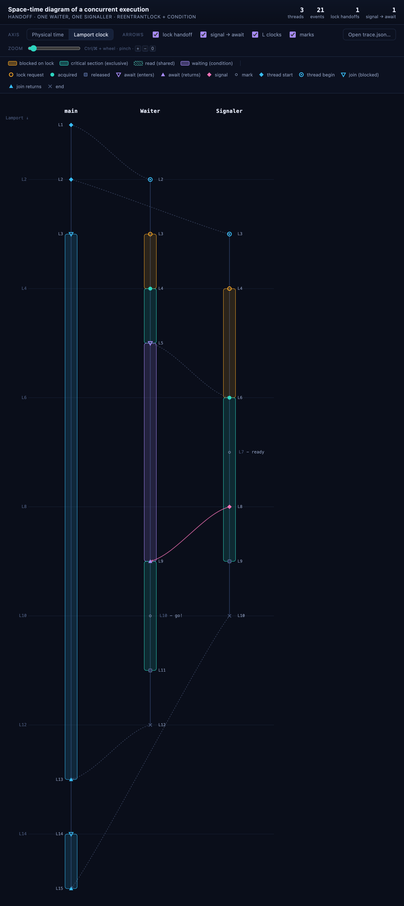

# java-concurrency-tracer


*The smallest possible example: `Waiter` parks on a condition, `Signaler` sets a flag
and wakes it, `main` joins both. Every event above is caused by the one before it —
that causal chain is what this tool makes visible.*

A Java agent that lets you see causality in concurrent programs. Point it at any
program that uses locks and condition variables and you get a space-time diagram
of what actually happened: who blocked on which lock, who waited on which
condition, who signalled whom, and which events really happened before which —
annotated with Lamport clocks. Your own code stays exactly as it is.

## Setup

### Build the jar

```bash
./build.sh
```

Produces `sdtrace-agent.jar` — the same file works both as a `-javaagent` and as
a library on the classpath. It's already committed, so this step is optional
unless you've changed the source.

### IntelliJ IDEA

1. **Project SDK**: *File → Project Structure → Project → SDK* → a JDK **24 or
   higher** (*Add SDK → Download JDK…* if none is installed).
2. **Add the library**: right-click `sdtrace-agent.jar` → **Add as Library…**
   (needed for `Tracer.note(...)`).
3. **Activate the agent**: *Run → Edit Configurations…* → select your run
   configuration → **Modify options → Add VM options**, then set:

   ```
   -javaagent:sdtrace-agent.jar=include=your.package
   ```

   (wrap it in quotes if the path contains spaces). Run it — the console should
   print `[sdtrace] agent active | include=your/package`; if it doesn't, the
   `-javaagent` option wasn't picked up.

### javac and java

```bash
javac -g -cp sdtrace-agent.jar -d out src/*.java
java -javaagent:sdtrace-agent.jar=include=your.package -cp sdtrace-agent.jar:out Main
```

On Windows, use `;` instead of `:` as the classpath separator. `include=` takes
comma-separated package prefixes and keeps other classpath libraries' internal
locks out of the diagram; `-g` only matters for locks held in local variables
(see Known limitations).

## Usage

### Instrumenting a class

Write plain `java.util.concurrent.locks` code — nothing from this project:

```java
private final Lock lock = new ReentrantLock();
private final Condition notFull = lock.newCondition();
private final Condition notEmpty = lock.newCondition();

void produce(int value) throws InterruptedException {
    lock.lock();
    try {
        while (buf.size() == CAPACITY) notFull.await();
        buf.add(value);
        notEmpty.signal();
    } finally {
        lock.unlock();
    }
}
```

The agent weaves `lock()`/`unlock()`/`await()`/`signal()`/`signalAll()` calls at
class-loading time. Lock and condition names come from the field that holds them
(`lock`, `notFull`, `notEmpty` above) — that's what shows up in the diagram.

### Marking your own events

```java
Tracer.note("produced " + value);
```

Puts an application-level mark on the diagram at that point in time. This is the
one API call that needs `sdtrace-agent.jar` on the *compile* classpath.

### Viewing the diagram

Running the program writes `trace.json` to the working directory (via a
shutdown hook — in IntelliJ that's the run configuration's working directory).
Open `viz/spacetime.html` — a single file that works offline, no server needed
— or the hosted [visualizer](https://fntneves.github.io/java-concurrency-tracer/)
— and use **Open trace.json…**.

| | |
|---|---|
| 🟧 amber | blocked, waiting to acquire the lock |
| 🟩 turquoise (solid) | holding the lock (exclusive) |
| 🟩 turquoise (hatched) | holding a read lock (shared — can overlap across threads) |
| 🟪 violet | waiting on a condition (`await()`) |
| ⋯ dashed grey arrow | lock handoff: one thread's release causes another's acquire |
| ⋯ pink arrow | `signal()`/`signalAll()` causes the matching `await()` return |

Toggle **Physical time / Lamport clock** to switch between actual wall-clock
duration and causal order; `Ctrl`/`⌘` + wheel (or pinch) zooms the time axis.
`ReentrantReadWriteLock` is supported the same way — concurrent readers show up
as overlapping hatched bands on separate threads.

### Running the bundled demo

```bash
./run-demo.sh                                          # demo/BoundedBufferRaw
./run-demo.sh demo/HandoffRaw.java HandoffRaw           # the run pictured above
./run-demo.sh demo/ReadersWritersRaw.java ReadersWritersRaw
```

Builds the jar, runs the given demo class with the agent attached, and
re-embeds the resulting trace into `viz/spacetime.html` — which rewrites that
committed file. Undo with `git checkout -- viz/spacetime.html`.

## Known limitations

- Requires **JDK 24+** (`java.lang.classfile` is final in JDK 24).
- Only `java.util.concurrent.locks.*` is instrumented — `synchronized`,
  `wait()`/`notify()`, `tryLock()`, and the timed `await` variants are not.
- `signal()` → `await()` pairing is **FIFO and approximate**: Java doesn't
  guarantee wakeup order, and spurious wakeups aren't modeled.
- Thread lifecycle tracing covers no-arg `start()`/`join()` only; `join(long)`
  isn't woven, and a thread that dies from an uncaught exception leaves its
  lane open-ended.
- Lock/condition names come from **fields** reliably; **local variables** need
  `-g` (most IDEs and build tools already compile with it) or they fall back to
  `Type@Class:line`.
- Recording is serialized through a single monitor, which introduces a small
  observation effect — good for seeing blocking patterns, not for
  micro-benchmarks.
- Reentrant acquisition of the same lock shows up as a new request/acquire
  pair, not as nesting.
